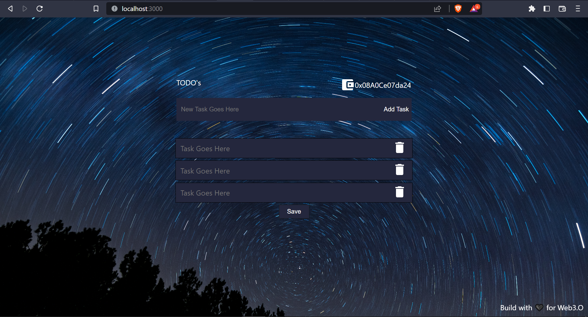
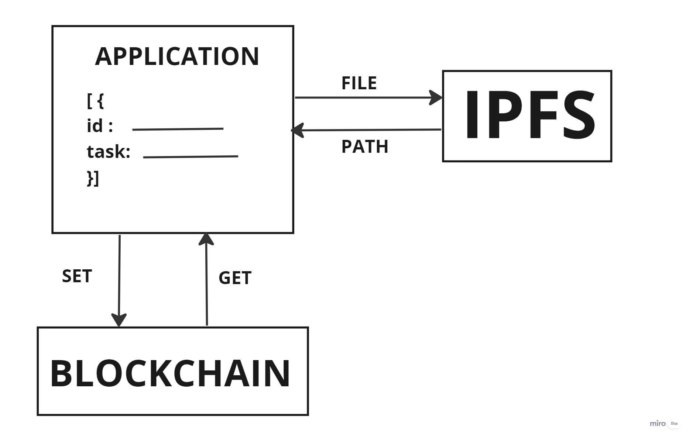

# Todo App using Blockchain and IPFS (InterPlanetry File System) 

### Application UI


### Tools Used 
* Remix IDE
* Ganache 
* IPFS Desktop
* MetaMask Wallet
* React.js


### Working 



* Task file will be stored in ipfs using ``` ipfs.add(file) ``` command.
* IPFS will return file path and store that file path in blockchain using ```add``` method defined in smart contract.
* Get the file path from blockchain using ```display``` method defined in smart contract.
* Extract the file data using  ```ipfs.cat(path)``` command.

We're using IPFS here, because to store data onto blockchain is costly & IPFS allows us to store large files and for security purposes we are using blockchain to store file address.


### Installation

```bash
npm install
```
To install all the dependencies and packages used in this project.

### Troubleshoot
* Go through the code carefully and use google for any minor issues
* Raise an issue if you can't find solutions online.
